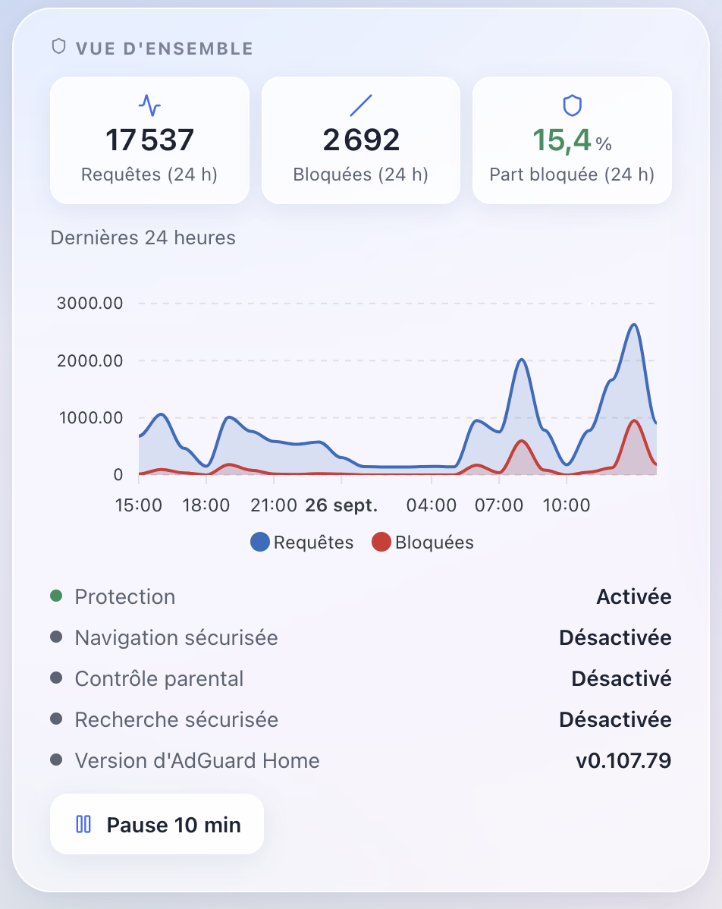
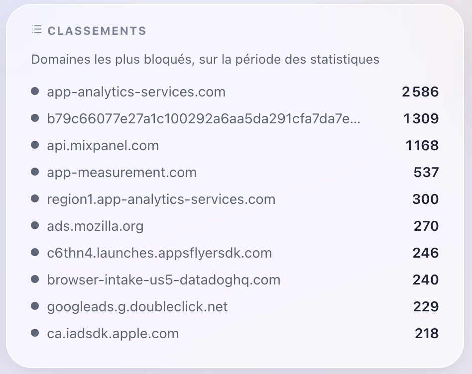

# AdGuard Home — Gladys Assistant external integration

Control the DNS protection of [AdGuard Home](https://github.com/AdguardTeam/AdGuardHome)
from [Gladys Assistant](https://gladysassistant.com) and follow its blocking
statistics. Built as an external integration running in its own container, on
the JavaScript SDK
[`@gladysassistant/integration-sdk`](https://github.com/GladysAssistant/integration-sdk-js).

> **Requires Gladys ≥ 5.1.0** (dashboard widgets and scene actions of external
> integrations). `gladys_version` in the manifest declares that floor.

## Features

- One **AdGuard Home** device, published to the Discovery tab as soon as the
  connection works:
  - 4 switches: DNS protection, safe browsing, parental control, safe search;
  - 4 sensors: DNS queries (24 h), blocked queries (24 h), blocked queries
    ratio (24 h, %, rounded), average processing time (ms).
- **Overview** widget: queries / blocked / blocked share tiles, 24 h hourly
  chart, status of the protection and filters, **Pause 10 min** / **Resume
  protection** button.
- **Top lists** widget: most blocked domains, most queried domains or most
  active clients, over AdGuard's statistics retention period.
- **Pause DNS protection** scene action (30 s to 24 h), with
  `resume_time` (local HH:MM) and `resume_at` (ISO) outputs.
- **Block or unblock services** scene action: 25 curated services, for the
  whole network or one persistent AdGuard client, with a `blocked_services`
  output.
- Polling at 30 s, 1 min or 5 min, publishing only the values that changed;
  polling is suspended after a refused password so the Gladys host does not get
  locked out by AdGuard Home's login rate limit.

## Screenshots

| Overview widget                                                               | Top lists widget (most blocked domains)                                       |
| ----------------------------------------------------------------------------- | ----------------------------------------------------------------------------- |
|  |  |

## Install

- **From Gladys**: install **AdGuard Home** from the integration store (Gladys
  5.1.0 or later), then fill in the configuration screen.
- **Development**: run it outside Docker against a local Gladys, see
  [Run locally](#run-locally).

## Configuration

| Field                | Description                                                                                         |
| -------------------- | --------------------------------------------------------------------------------------------------- |
| AdGuard Home address | URL of the web interface, port included: `http://192.168.1.10:3000`, or `https://…` behind a proxy. |
| Username / Password  | AdGuard Home web interface account; leave both empty when AdGuard Home runs without authentication. |
| Refresh frequency    | 30 seconds, 1 minute (default) or 5 minutes.                                                        |

The **Test the connection** button checks the settings and resumes a polling
suspended by a refused password. Full user documentation, including
troubleshooting: [`docs/en.md`](./docs/en.md) / [`docs/fr.md`](./docs/fr.md).

## Development

Requires Node.js 20 or later.

```bash
npm ci
npm test               # unit tests (node --test)
npm run lint           # ESLint
npm run format:check   # Prettier
npm run coverage       # tests + coverage thresholds (needs Node >= 22.8)
```

Validate the manifest with the store's checker:

```bash
npx github:GladysAssistant/integration-store .
```

### Run locally

Register the integration in development mode in a Gladys 5.1+ server to get
its token and selector, then:

```bash
GLADYS_HOST_API_URL="http://localhost:1443" \
GLADYS_INTEGRATION_TOKEN="<token>" \
GLADYS_INTEGRATION_SELECTOR="<selector>" \
LOG_LEVEL=debug \
npm start
```

Set `DEBUG=gladys-integration-sdk` as well to have the SDK validate every
widget content it sends.

## Architecture

```
├─ index.js                          # wires the SDK handlers to AdGuardIntegration, no logic
├─ src/
│  ├─ integration.js                 # AdGuardIntegration: client, polling, snapshot, every SDK handler
│  ├─ config.js                      # config defaults, URL normalization, type coercion
│  ├─ devices.js                     # the Gladys device, its 8 features, states and switch commands
│  ├─ poller.js                      # self-scheduling polling loop with refresh-after-command
│  ├─ widgets.js                     # overview and ranking widget content, overview button actions
│  ├─ scene-actions.js               # pause_protection and blocked_services scene actions
│  ├─ lifecycle.js                   # init retry with backoff, unhandled-rejection exit
│  └─ adguard/
│     ├─ client.js                   # AdGuard Home HTTP API client, errors and user-facing messages
│     └─ snapshot.js                 # one polling round: API reads reduced to a snapshot
├─ test/                             # node:test unit tests (fake Gladys, fake AdGuard)
├─ docs/{en,fr}.md                   # user documentation (shown in the Gladys catalog)
├─ gladys-assistant-integration.json # manifest
└─ Dockerfile                        # image run by the Gladys supervisor
```

## Synced files

`.github/workflows/`, `.github/dependabot.yml` and `SECURITY.md` are synced
from [cicoub13/integration-kit](https://github.com/cicoub13/integration-kit).
Do not edit them here: the next sync overwrites local changes. Change the
templates in integration-kit instead.

## License

Apache-2.0
